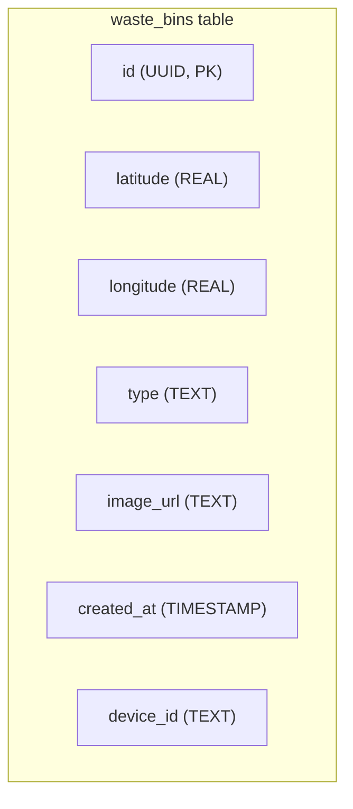

# Modification Design: Supabase, Cloudinary, and Device ID Integration

## 1. Overview

This document outlines the design for integrating Supabase as the primary backend, Cloudinary for image hosting, and associating a unique device ID with user-contributed data. This change migrates the application from its current backend (Firebase) to a Supabase-powered backend.

## 2. Detailed Analysis

The current application uses Firebase for its backend services. The goal is to replace Firebase with Supabase for database and authentication, and to use Cloudinary for image storage. Additionally, a device ID will be captured and stored with each new waste bin entry to uniquely identify the contributor without requiring user authentication.

### 2.1. Problem

- The existing Firebase implementation needs to be replaced.
- A new database schema is required for Supabase.
- Image upload functionality needs to be implemented using Cloudinary.
- A mechanism to get and store a unique device ID is needed.

### 2.2. Goal

- Replace Firebase with Supabase for backend services.
- Use Cloudinary for image storage.
- Associate a unique device ID with each waste bin submission.
- Ensure the application remains functional after the migration.

## 3. Alternatives Considered

### 3.1. Backend

- **Firebase (current):** While functional, the decision has been made to move to Supabase.
- **Self-hosted backend:** This would provide more control but also require more maintenance and setup.

### 3.2. Image Storage

- **Supabase Storage:** Supabase provides its own storage solution. However, Cloudinary is chosen for its powerful image and video API, which includes transformations, optimizations, and a generous free tier.
- **Firebase Storage:** The current solution, which will be deprecated.

### 3.3. Device ID

- **`device_info_plus`:** This package provides a comprehensive way to get device information, including a unique ID for each platform.
- **`uuid`:** A package to generate unique IDs, but these would not be tied to the physical device.

## 4. Detailed Design

### 4.1. Supabase Integration

- A new `SupabaseClientService` will be created to manage the Supabase client instance.
- The service will be initialized using credentials from a `.env` file.
- A new `waste_bins` table will be created in the Supabase database.

### 4.2. Database Schema

A new table `waste_bins` will be created with the following schema:

### 4.3. Repository Layer

- A `WasteBinRepository` will be created to handle all CRUD (Create, Read, Update, Delete) operations for the `waste_bins` table.
- This repository will use the `SupabaseClientService` to interact with the database.

### 4.4. Cloudinary Integration

- The `cloudinary_flutter` and `cloudinary_url_gen` packages will be used for image uploads.
- A new service will be created to handle image uploads to Cloudinary.
- The image URL returned from Cloudinary will be stored in the `image_url` field of the `waste_bins` table.

### 4.5. Device ID

- The `device_info_plus` package will be used to get a unique device ID.
- A new service will be created to abstract the device ID retrieval logic.
- The device ID will be stored in the `device_id` field of the `waste_bins` table.

## 5. Summary

This design covers the migration from Firebase to Supabase, the integration of Cloudinary for image storage, and the addition of a device ID to waste bin submissions. The implementation will involve creating new services for Supabase, Cloudinary, and device ID retrieval, as well as a new repository for waste bin data.

## 6. Research

- **Supabase:** [https://supabase.io/](https://supabase.io/)
- **Cloudinary:** [https://cloudinary.com/](https://cloudinary.com/)
- **device_info_plus:** [https://pub.dev/packages/device_info_plus](https://pub.dev/packages/device_info_plus)
- **flutter_dotenv:** [https://pub.dev/packages/flutter_dotenv](https://pub.dev/packages/flutter_dotenv)
