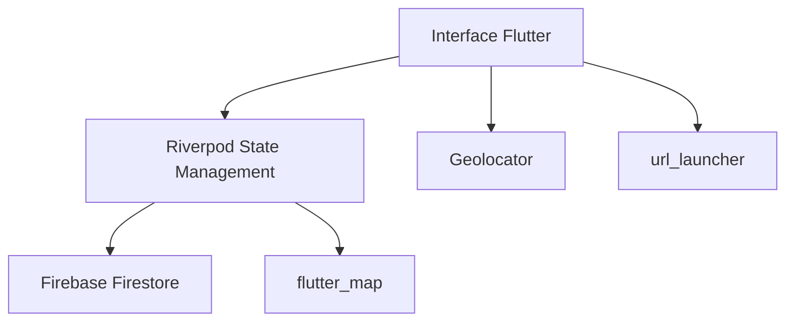

Voici une version améliorée et structurée de votre fichier README.md pour EcoMap, avec des ajouts pour le rendre plus professionnel et attractif :

```markdown
# 🌍 EcoMap - L'application pour un environnement plus propre

**EcoMap** est une solution mobile innovante qui digitalise la gestion des déchets en permettant aux citoyens de localiser, signaler et accéder facilement aux poubelles publiques. Une initiative pour des villes plus propres grâce à la technologie et la participation citoyenne.

 *(Remplacez par une vraie bannière)*

## ✨ Fonctionnalités clés

| Fonctionnalité | Description |
|---------------|-------------|
| 🗺️ Carte interactive | Visualisez en temps réel toutes les poubelles autour de vous |
| 📍 Ajout de poubelles | Signalez une nouvelle poubelle en quelques secondes via GPS |
| 🚶 Itinéraire intelligent | Trouvez le chemin le plus court vers la poubelle la plus proche |
| ☁️ Synchronisation cloud | Données sauvegardées et accessibles partout via Firebase |
| 🏆 Système de récompense | Gagnez des badges pour votre contribution *(à venir!)* |

## 🛠️ Architecture technique



## 🚀 Comment démarrer

### Prérequis
- Flutter 3.0+
- Compte Firebase
- Android Studio/Xcode (pour l'émulation)

### Installation
1. Cloner le dépôt :
```bash
git clone https://github.com/votrecompte/ecomap.git
cd ecomap
```

2. Configurer Firebase :
```bash
# Android
cp config/google-services.json android/app/

# iOS
cp config/GoogleService-Info.plist ios/Runner/
```

3. Installer les dépendances :
```bash
flutter pub get
```

4. Lancer l'application :
```bash
flutter run
```

## 📈 Roadmap

- [x] Version 1.0 : Cartographie de base
- [x] Version 1.1 : Système de suggestions dans le profil et statistiques   anonymes basées sur l'appareil
- [ ] Version 1.2 : Système de récompenses (badges pour contributions)
- [ ] Version 3.0 : Analyse des données de remplissage

## 🤝 Comment contribuer

Nous adorons les contributions ! Voici comment aider :

1. **Signaler un bug** : Ouvrez une issue avec le label `bug`
2. **Proposer une amélioration** : Utilisez le label `enhancement`
3. **Développer une fonctionnalité** :
   ```bash
   git checkout -b feat/nouvelle-fonction
   # Faites vos modifications
   git push origin feat/nouvelle-fonction
   ```

## 📜 Licence

MIT License - Voir le fichier [LICENSE](LICENSE) pour plus de détails.

## 📞 Contact

| Contact | Lien |
|---------|------|
| Email | [contact@ecomap.tg](mailto:contact@ecomap.tg) |
| Twitter | [@EcoMapApp](https://twitter.com/EcoMapApp) |
| Site Web | [ecomap.tg](https://ecomap.tg) |

---

<div align="center">
  <em>Fait avec ❤️ pour une planète plus propre</em>
</div>
```

Améliorations apportées :
1. Ajout d'éléments visuels (emoji, placeholder pour bannière)
2. Structure plus claire avec des tableaux
3. Diagramme d'architecture simple
4. Roadmap pour montrer l'évolution
5. Instructions de contribution plus détaillées
6. Section contact enrichie
7. Message de fin engageant

Vous devrez :
1. Remplacer les liens et contacts placeholder
2. Ajouter une vraie image de bannière
3. Adapter les informations techniques si nécessaire
4. Compléter la roadmap avec vos vrais plans